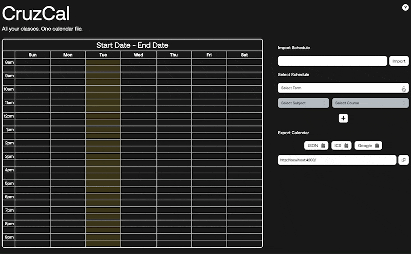
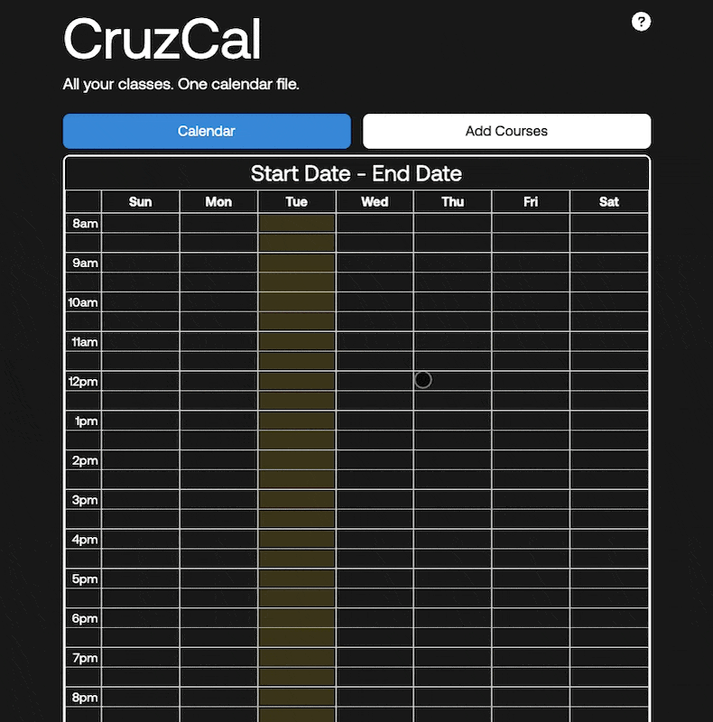
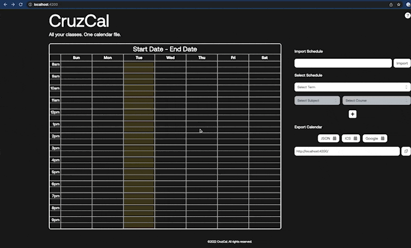
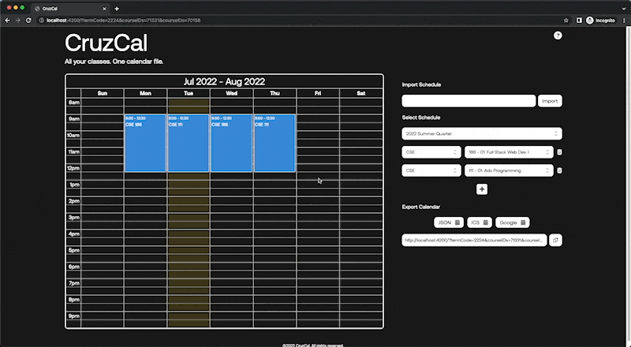

# CruzCal
All your classes. One calendar file.
## What is CruzCal? 
A productivity tool for UC Santa Cruz students. CruzCal lets users select their Class and produce calendar files based on the class events they can import to their preferred calendar. Users will also be able to import this Calendar to Google Calendar (built-in OAuth Consent). 

## What is the goal? 
Help students save time! 

## How is this done? 
We scrape the information from PISA and essentially build our database of classes with regular updates to make sure class information is up to date. This database is then used to pull data whenever the user makes a request. We then use a calendar module to generate a .ics file or give the option to the user to log in with Google and add to their Google Calendar.

## Team
- Tanmay Mittal 
- Kitana Toft
- Andrew Lim
- Pablo Gaeta
- Mario Reyes

# Usage

## How do I add or remove courses to the Calendar?

### To add a course to the Calendar:
1. Select a Term.
2. Select a Subject.
3. Select a Course.

In addition, you can also filter the options by typing in the input.

**Note**: You will not be able to select/type a Subject until you have picked a Term. Similarly, you will not be able to select/type a Course until you have selected a Subject.

### To add an additional class:
1. Click the “+” icon below the bottom-most Subject/Course selections row.
2. Select a Subject.
3. Select a Course.

### To remove a class:
1. Click the trashcan icon to the right of a Subject/Course selections row.

**Note**: The trashcan icon is hidden if there is only a single Subject/Course selections row.

## How do I export my schedule?
You have 3 options to export the courses you have added to the calendar:
1. JSON: will open a new tab with all of the information related to any courses you have added.
2. ICS: your schedule will be downloaded to your computer as an .ics file.
3. Google: your schedule is automatically imported into your **UCSC Google Calendar**.

## How do I view the calendar and list of courses added on mobile/tablet?
In order to create an effective user experience, the calendar and list of courses were separated into two separated tabs on smaller devices. In order to switch the calendar and the list of courses added:

1. Click “Add Courses” to view the list of courses added and to add/remove additional courses.
2. Click “Calendar” to view the schedules of the courses you have added.

## Feature: Undo and Redo Adding/Removing a Course
You can click the back button or the forward button in the browser to undo or redo adding or removing a course.

## Feature: Export and Import Calendars
After adding any courses to the Calendar, you have the option to export a link to that Calendar with all of the added courses and send it to another person to import the schedule. In order to export and import the calendar:

1. Add any course(s) to the Calendar.
2. In the “Export Calendar” section, copy the URL link.
3. In the “Import Schedule” section, paste the URL link and click “Import”.
4. The courses will populate the Calendar and in the “Select Schedule” section.

## Warning: Selecting a Different Term with Added Courses
After selecting course(s), if you change the **Term**, it will refresh all selected courses as if it were a new session. Meaning any of the selected courses will be removed.
