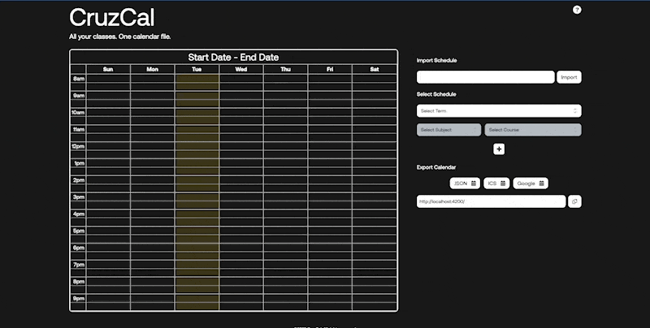
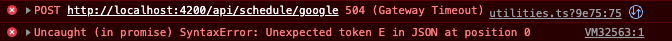

# Working Prototype Known Problems Report

**Product name**: CruzCal
**Team Name**: CruzCal Developers
**Team Members**: Tanmay Mittal, Kitana Toft, Mario Reyes, Pablo Gaeta, Andrew Lim
**Release Name**: 1.0
**Release Date**: Monday, May 23, 2022
**Revision Number**: 0.1
**Revision Date**: Tuesday, May 31, 2022

**Description**: Known problems listed by domain:

---

## e2e issues

If the google api call during Google Calendar submission fails due to…
network connection

- incorrect events format (this might be handled)
- the user refuses the calendar scope when authorizing with google

Then the submission will fail silently

Clicking the “Google” button adds course events to Google Calendar and redirects to the. On first submission, authorization is required through Google which causes the redirect to be blocked.

The slugsurvival API doesn’t track all terms and has ambiguous naming, so only a single session is tracked for summer quarters (and we don’t know which).
For example:

- “2022 Summer Quarter” actually refers to the second session of the 2022 Summer Quarter

We were hoping to build our own scraper, so for the future we would be making this distinction without the constraint of the slugsurvival API.

---

## Backend issues

None

---

## Frontend issues

1. If following criteria are met on the frontend, submission fails silently
    1. At least one partially complete or empty course row
    2. No term selected
2. If a User attempts to export a calendar to Google calendar too many times in a short span of time, they might get the following error: **GaxiosError: Calendar usage limit exceeded**.
    1. Relevant Article: https://support.google.com/a/answer/2905486?hl=en
    2. When the schedule is exported to Google, the courses are removed from the Calendar and the List of Courses. When the page is refreshed, however, the Courses appear back in the Calendar and the List of Courses.

    3. The “Google” export button does not work after it is clicked and a Syntax error is thrown to the console.

3. The CalendarView tests occasionally fail, likely due to a timeout when the userEvent does not click on a Subject, which causes the Course to load multiple options instead of a single one. A potential future fix would be breaking down these tests into small tests until they consistently pass.
